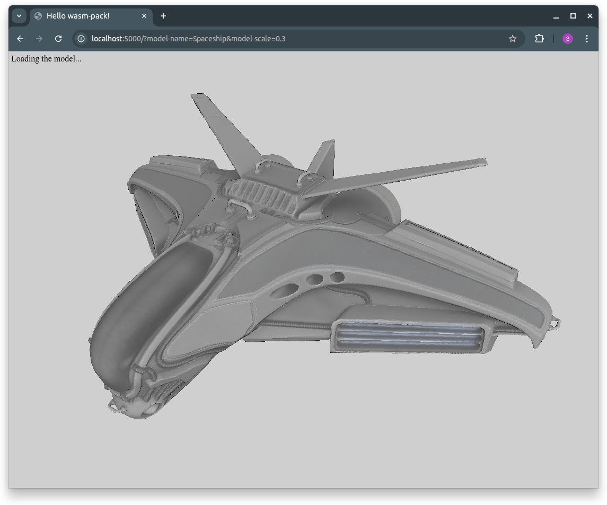
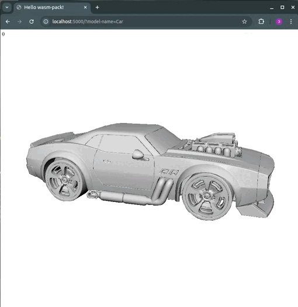

# 🎮 WebAssembly 3D Model Viewer

A high-performance 3D model viewer built with Rust (WebAssembly) and JavaScript, featuring real-time rendering with PBR (Physically Based Rendering) materials and interactive camera controls.

## 🎬 Demo

### Spaceship model



### Car model



### Iron-man model


## 🚀 Features

### 🖥️ Core Rendering
- **WebAssembly-powered 3D engine** 🦀 written in Rust for optimal performance
- **Software rasterization** with custom rendering pipeline
- **PBR material support** ✨ with multiple texture maps:
  - 🎨 Diffuse maps (albedo/color)
  - 🔍 Normal maps (surface detail)
  - ✨ Specular maps (reflectivity)
  - 💡 Emission maps (self-illumination)
- **Real-time lighting** ⚡ calculations
- **Z-buffer depth testing** for proper occlusion

### 🎯 Interactive Controls
- **Keyboard navigation** ⌨️:
  - `WASD` - Move camera (left/right/forward/backward)
  - `QE` - Move camera up/down
  - `Arrow keys` - Fine camera rotation
  - `Space` - Toggle automatic model rotation

### 📦 Model Support
- **OBJ file format** 📄 support
- **Multiple pre-loaded models** 🎭:
  - Head, Car, Cube, Diablo, Iron-man, Pony-car, Shovel-knight, Spaceship, Suzuki
- **Configurable parameters** ⚙️:
  - Model scale and rotation
  - Camera movement speed
  - Individual texture map toggles

## 🏗️ Architecture

The project consists of three main components:

### 1. Core Engine (`/core`) - Rust/WebAssembly
- **Language**: Rust
- **Build**: WebAssembly via `wasm-pack`
- **Purpose**: High-performance 3D rendering engine
- **Key modules**:
  - `image.rs` - Main rendering engine and pixel buffer management
  - `camera.rs` - Camera transformations and view matrices
  - `world.rs` - Scene management and object handling
  - `object.rs` - 3D object representation and transformations
  - `raster.rs` - Software rasterization algorithms
  - `texture.rs` - Texture sampling and filtering
  - `types.rs` - Mathematical types and structures

### 2. Client (`/client`) - JavaScript/WebPack
- **Language**: JavaScript (ES6+)
- **Build**: WebPack
- **Purpose**: User interface and WebAssembly integration
- **Key features**:
  - WebAssembly module loading and memory management
  - Canvas-based rendering output
  - Real-time user input handling
  - Texture loading and processing via `image-js`
  - FPS monitoring and performance metrics

### 3. Server (`/server`) - Node.js/TypeScript
- **Language**: TypeScript
- **Runtime**: Node.js with Express
- **Purpose**: Asset serving and model data API
- **Endpoints**:
  - `/raw/model?model-name=<name>` - Parsed OBJ model data as JSON
  - `/source/<model>/<file>` - Static texture and model files

## 🛠️ Setup and Installation

### Prerequisites
- **Rust** (latest stable) - [Install Rust](https://rustup.rs/)
- **wasm-pack** - [Install wasm-pack](https://rustwasm.github.io/wasm-pack/installer/)
- **Node.js** (v14+) - [Install Node.js](https://nodejs.org/)

### Quick Start

1. **Clone the repository**
   ```bash
   git clone <repository-url>
   cd webasm-3d-viewer
   ```

2. **Build the core project**
   ```bash
   cd core
   webasm-pack build
   ```

3. **Build the client project**
   ```bash
   cd ../client
   npm install
   npm run build
   ```

4. **Start the server**
   ```bash
   cd ../server
   npm install
   npm start
   ```

5. **Open your browser**
   Navigate to `http://localhost:5000`

## 🎮 Usage

### URL Parameters
Customize the viewer experience with URL parameters:

```
http://localhost:5000/?model-name=Car&model-scale=0.2&model-rotation=true
```

**Available parameters**:
- `model-name` - Model to load (default: "Head")
- `camera-speed` - Camera movement sensitivity (default: 0.05)
- `rotation-speed` - Auto-rotation speed (default: 0.1)
- `model-scale` - Model scale factor (default: 0.1)
- `model-rotation` - Enable auto-rotation (default: false)
- `normal-map` - Use normal maps (default: true)
- `diffuse-map` - Use diffuse maps (default: true)
- `specular-map` - Use specular maps (default: true)
- `emission-map` - Use emission maps (default: true)

### Controls
- **WASD**: Move camera position
- **QE**: Move camera up/down
- **Arrow Keys**: Fine camera rotation
- **Space**: Toggle model auto-rotation

## 🔧 Development

### Adding New Models
1. Place model files in `/server/public/source/<ModelName>/`:
   - `Model.obj` - The 3D model
   - `Diffuse map.png` - Base color texture
   - `Normal map.png` - Normal map texture
   - `Specular map.png` - Specular reflection map
   - `Emission map.png` - (Optional) Emission texture

2. Use the model by setting `?model-name=<ModelName>` in the URL

### Performance Tuning
- Adjust `model-scale` for very large/small models
- Reduce texture resolution for better performance
- Disable unused texture maps via URL parameters
- Monitor FPS counter in the top-left corner

### Debugging
- Check browser console for WebAssembly loading errors
- Verify model files are properly formatted OBJ files
- Ensure texture files are valid PNG images
- Use browser developer tools to monitor memory usage

## 🏛️ Technical Details

### Rendering Pipeline
1. **Model Loading**: OBJ files parsed server-side to JSON
2. **Texture Loading**: PNG textures loaded via `image-js`
3. **Geometry Processing**: Vertices, normals, and UV coordinates processed
4. **Rasterization**: Custom software rasterizer in Rust/WASM
5. **Shading**: Per-pixel lighting with PBR material model
6. **Output**: Direct pixel buffer rendering to HTML5 Canvas

### Performance Characteristics
- **WebAssembly**: Near-native performance for computation-heavy operations
- **Memory Management**: Direct memory access between WASM and JavaScript
- **Real-time**: 60 FPS target with dynamic quality adjustment
- **Browser Compatibility**: Modern browsers with WebAssembly support

### Memory Layout
- **Vertex Data**: Interleaved position, normal, and UV coordinates
- **Pixel Buffer**: RGBA8 format directly accessible from JavaScript
- **Texture Storage**: Managed in WebAssembly linear memory
- **Z-Buffer**: 32-bit floating-point depth values

## 📄 License

This project is available under dual licensing:
- **Apache License 2.0** (`LICENSE-APACHE`)
- **MIT License** (`LICENSE-MIT`)

## 👨‍💻 Author

**Zakhar Kot** - [kot.zakhar@gmail.com](mailto:kot.zakhar@gmail.com)

## 🤝 Contributing

Contributions are welcome! Please feel free to submit a Pull Request. For major changes, please open an issue first to discuss what you would like to change.

### Development Setup
1. Fork the repository
2. Create your feature branch (`git checkout -b feature/AmazingFeature`)
3. Commit your changes (`git commit -m 'Add some AmazingFeature'`)
4. Push to the branch (`git push origin feature/AmazingFeature`)
5. Open a Pull Request

## 🚀 Future Enhancements

- Hardware-accelerated WebGPU rendering pipeline
- GLTF model format support
- Advanced lighting models (IBL, shadows)
